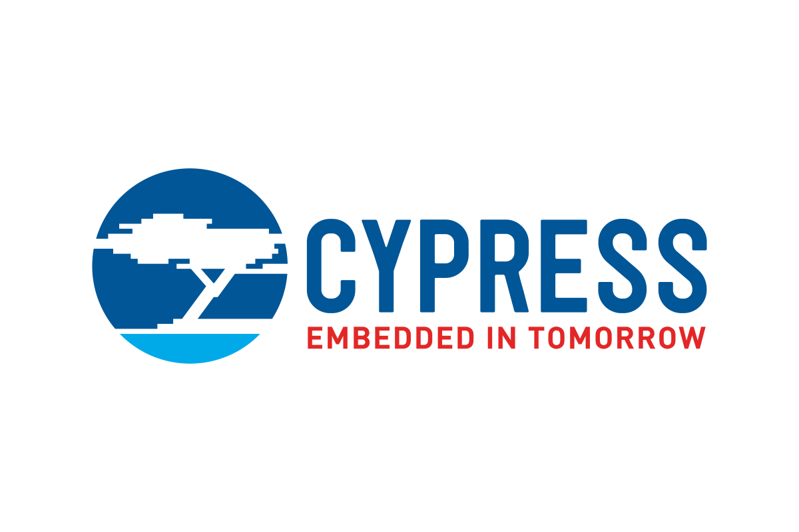

# Hey there , I'm [Ryan Printup](https://ryanprintup.com)

I live in Buffalo, NY and work as an Electrical & Software Engineer. In my spare time I work on side projects, learn new recipes, and play guitar with my friends in [Neon Rain Band](https://neonrainband.com).

## 💬 Stay in Touch!

You can see what I'm up too through my social media.

 
 

## 🚀 What I Can Do

Click a section below to see tools & skills I have used before.

	
💻 Languages

	 
	<ul>
		<li>C</li>
		<li>C++</li>
		<li>Python</li>
		<li>C#</li>
		<li>HTML5</li>
		<li>CSS3</li>
	</ul>

	
🏗️ Libraries & Frameworks

	 
	<ul>
		<li>STM32 HAL</li>
		<li>Qualcomm ADK</li>
		<li>Google Protocol Buffers</li>
		<li>Bootstrap</li>
		<li>React.JS</li>
		<li>Jekyll</li>
	</ul>

	
 Software Tools

	 
	<ul>
		<li>VSCode</li>
		<li>Visual Studio</li>
		<li>Windows OS</li>
		<li>Microsoft Office</li>
		<li>Linux OS (Ubuntu, Mint, CentOS)</li>
		<li>Trello</li>
		<li>Git</li>
		<li>GitHub</li>
		<li>BitBucket</li>
		<li>Jira</li>
		<li>Wireshark</li>
		<li>GitHub Actions</li>
		<li>GNU Make</li>
	</ul>

	
🔨 Hardware Tools

	 
	<ul>
		<li>SPICE</li>
		<li>Breadboards</li>
		<li>Function Generator</li>
		<li>Logic Analyzer</li>
		<li>Multimeter</li>
		<li>Oscilloscope</li>
		<li>Power Supply</li>
		<li>Protocol Analyzer</li>
		<li>Soldering Iron</li>
		<li>Debugger</li>
	</ul>

	
📡 Protocols

	 
	<ul>
		<li>Ethernet</li>
		<li>EtherCAT</li>
		<li>SPI</li>
		<li>QSPI</li>
		<li>I2C</li>
		<li>UART</li>
		<li>USART</li>
		<li>USB (HID, Hub, Audio)</li>
		<li>DFU</li>
	</ul>

	
🔩 Components & Peripherals

	 
	<ul>
		<li>GPIO</li>
		<li>ADC</li>
		<li>DAC</li>
		<li>DMA</li>
		<li>CRC</li>
		<li>NVIC</li>
		<li>USB (OTG, FS, HS, Device, Host)</li>
		<li>Timer</li>
		<li>PWM</li>
	</ul>

	
🔩 Processors

	 
	<table>
		<tr>
			<th>
                
            </th>
			<th>
                
            </th>
			<th>
                
            </th>
			<th>
                
            </th>
			<th>
                
            </th>
            <th>
                
            </th>
		</tr>
		<tr>
			<td>STM32H7</td>
			<td>QCC3024</td>
			<td>PSoC 5LP</td>
			<td>UNO</td>
			<td>3 Model B+</td>
            <td>XMC4800</td>
		</tr>
		<tr>
			<td>STM32F3</td>
			<td>QCC3034</td>
			<td></td>
			<td>Mega</td>
			<td></td>
            <td>XMC4700</td>
		</tr>
		<tr>
			<td>STM32G4</td>
			<td></td>
			<td></td>
			<td></td>
			<td></td>
			<td></td>
		</tr>
		<tr>
			<td>STM32G0</td>
			<td></td>
            <td></td>
			<td></td>
			<td></td>
			<td></td>
		</tr>
	</table>

